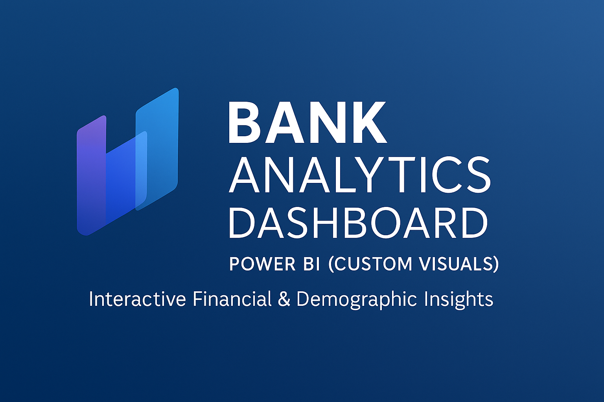
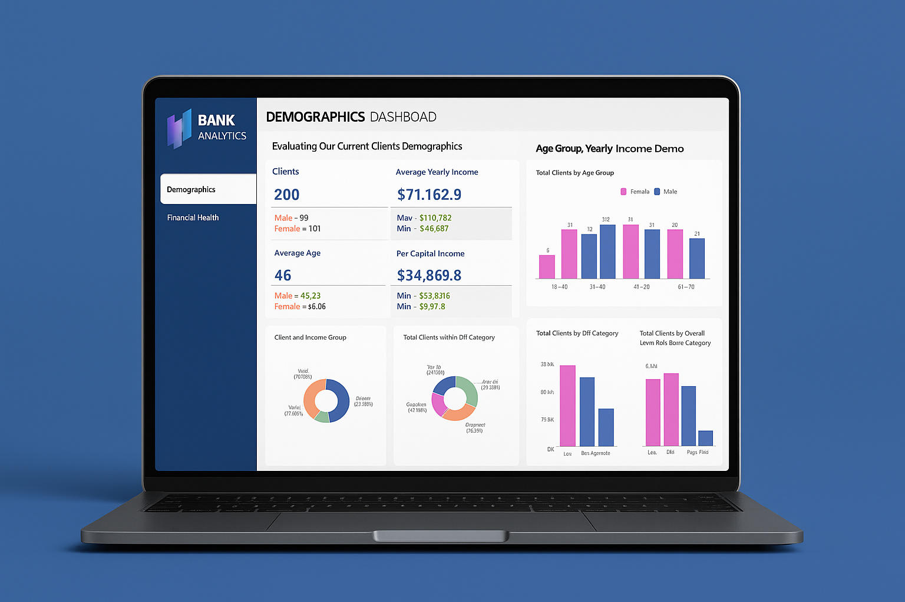
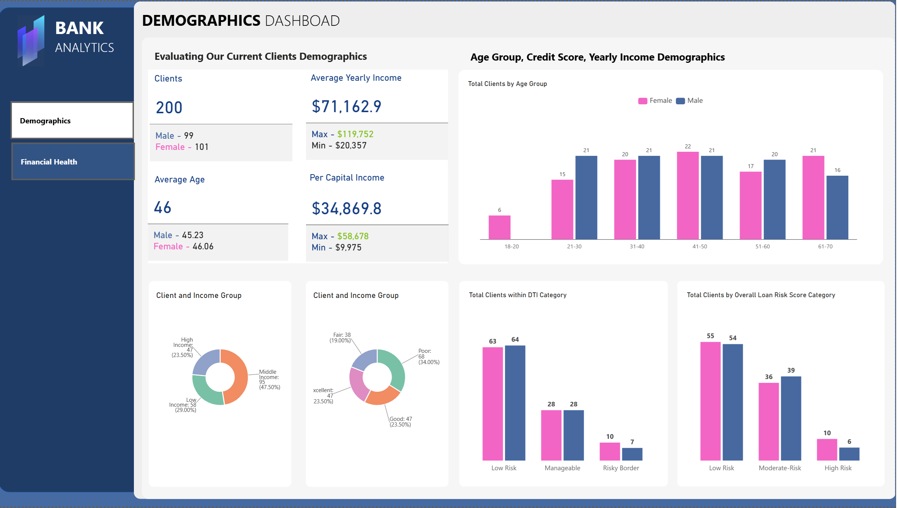
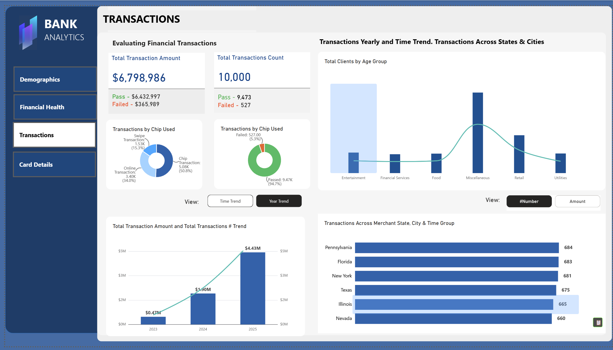
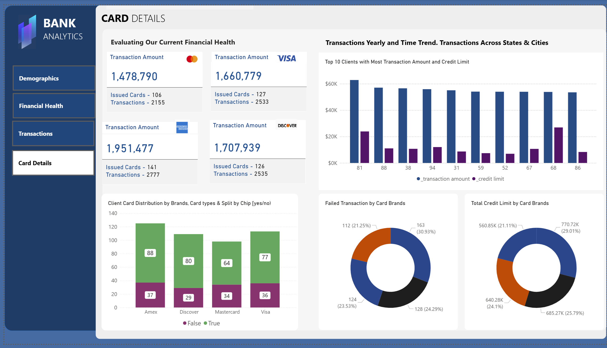

# Banking Analytics Dashboard

Interactive Power BI dashboard designed to analyze customer demographics, financial health, transactions, and behavioral patterns through modern data visualization and business intelligence techniques.

## Features

- Customer demographics analysis
- Financial health KPIs
- Transaction trends and payment behavior
- Cross-filtering across report pages
- Interactive navigation experience
- Custom visual design

## Technologies

- Power BI
- DAX
- Power Query
- SQL

## Live Dashboard

https://app.powerbi.com/view?r=eyJrIjoiNDViZTEwYWYtZDRjZS00YjQyLTk4NWUtMmUzYjExNzhlNDIwIiwidCI6IjA1MjEzYjk4LTdiNzAtNDNlOS05YjVmLWVkYmMzODhmNjRkMCJ9

## Screenshots

### Project Overview

### Dashboard Preview

### Demographics Analysis

### Financial Health Analysis

### Transaction Analysis

### Card Details

